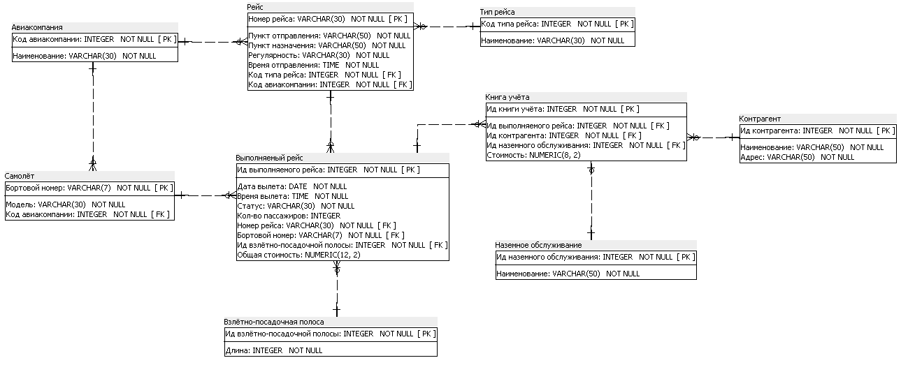
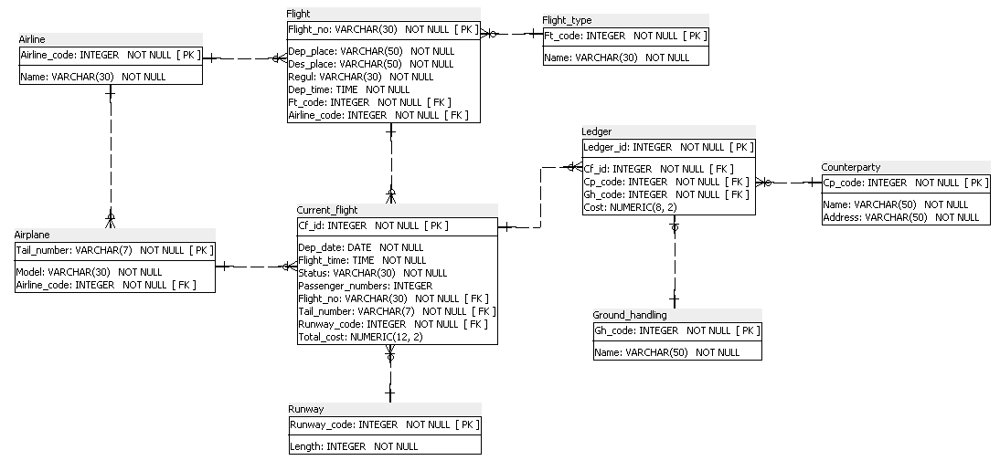

# FlightInformationSystem
This is training java project based on bussiness scope of airport and air travel. This application allows simple CRUD operations via PostgreSQL database which includes 9 interrelated tables.

## Logical schema

## Physical schema

## Technologies
• Java 14

• Spring Boot

• PostgreSQL

• Hibernate

• Thymeleaf

• Maven
